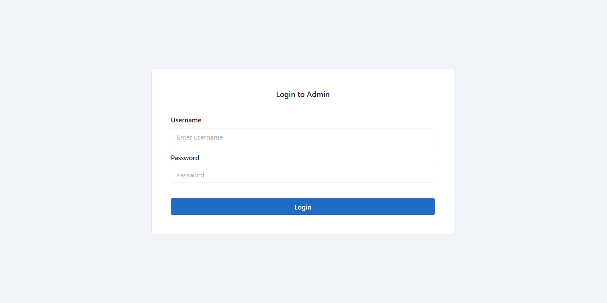
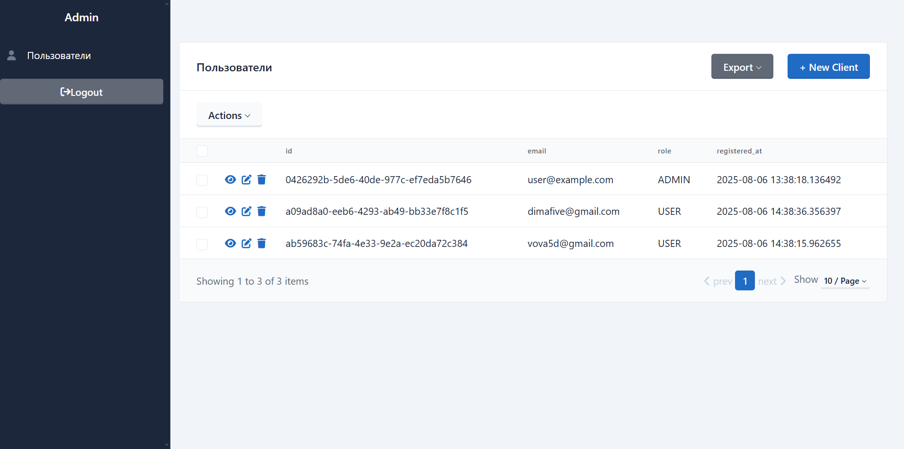

# FastAPI Image Generator

FastAPI Image Generator - это RESTful API-сервис, позволяющий пользователям генерировать изображения на основе текстового описания (prompt).<br>

Проект реализован с использованием FastAPI, вклюачет полноценную систему аутентификации на основе JWT, регистрацию, логин и хранение истории генераций. Ползьователь может авторизоваться, отправить текстовый запрос, получить до 10 изображений за раз и просматривать свою историю генераций.<br>

Также предусмотрены механизмы расширения: планируется реализация тегов, оценки изображений, админ-панели и контейнеризация через Docker.

---

## Функциональность
- 🔐 Регистрация и логин пользователей (JWT)
- 🧠 Генерация изображений по текстовому запросу (ограничение — до 10)
- 📜 История генераций для каждого пользователя
- 👤 Разграничение доступа по ролям

---

## Админ-панель
Для реализации админ-панели используется библиотека sqladmin - современный и удобный административный интерфейс для `FastAPI` и `SQLAlchemy`. С помощью `sqladmin` администраторы могут легко управлять данными в базе, создавать, редактировать и удалять записи, а также быстро просматривать историю генераций пользователей. Это позволяет значительно упростить администрирование и повысить эффективность работы без необходимости писать собственный интерфейс с нуля.



Описание: Главный экран админ-панели



Описание: Вид админ-панели после входа админа в систему

---

## Пример сгенерированного изображения

<p align="center">
    
</p>

Описание: Результат генерации по запросу "A cat in space"

---

<p align="center">
    
</p>

Описание: Результат генерации по запросу "A farmer and his wife"

---

## Архитектура и структура

Проект организован по модульному принципу:
- `routes` - обработка HTTP-запросов
- `models/schemas` - описания моделей данных (ORM и Pydantic)
- `service` - логика генерации изображений
- Авторизация реализована черезе OAuth2 с JWT-токенами
- Данные хранятся в базе PostgreSQL

---

## Стек технологий
- Python 3.10+
- FastAPI
- SQLAlchemy
- Pydantic
- JWT (OAuth2)
- PostgreSQL
- Alembic

---

## Установка и запуск

```bash
# Клонировать проект
git clone https://github.com/KusakinEgor/fastapi-image-generator.git
cd fastapi-image-generator

# Создать и активировать виртуальное окружение
python -m venv venv
source venv/bin/activate      # для Linux/macOS
venv\Scripts\activate         # для Windows

# Установить зависимости
pip install -r requirements.txt

# Запустить сервер
uvicorn app.main:app --reload
```
## Настройка Alembic (миграции БД)

Для управления миграциями в проекте используется Alembic.

### Конфигурация

- Файл `alembic.ini` содержит основные настройки подключения к базе данных.
- Файл `alembic/env.py` отвечает за интеграцию Alembic с вашим SQLAlchemy-моделями и контекстом БД.

> Важно:
> В `alembic.ini` нужно указать правильную строку подключения к вашей базе данных (например, PostgreSQL или SQLite).

### Как исползовать миграции

Создать новую миграцию (после изменений в моделях):

```bash
alembic revision --autogenerate -m "Описание миграции"
```
Применить миграции к базе:

```bash
alembic upgrade head
```
Откатить миграцию (если нужно):
```bash
alembic downgrade -1
```

> 💡 **Совет:**
> Для корректной работы Alembic в `env.py`:
> - Импортируйте все SQLAlchemy-модели (иначе Alembic не увидит изменения)
> - Убедитесь, что инициализирован движок SQLAlchemy (engine)

---

## Аунтификация
1. Зарегистрироваться через `/register`
2. Получить токен через `/token` (OAuth2PasswordRequest Form)
3. Использовать токен как `Bearer <token>` в заголовке Authorization

---

## TODO / Планы
- ✅ Регистрация и логин
- ✅ Генерация изображений
- ✅ История генераций
- 🚧 Админ-панель (в разработке)
- 🚧 Добавить поддержку тегов для изображений
- 🚧 Реализовать оценку картинок пользователями
- 📦 Docker и деплой
- 🧪 Автотесты
